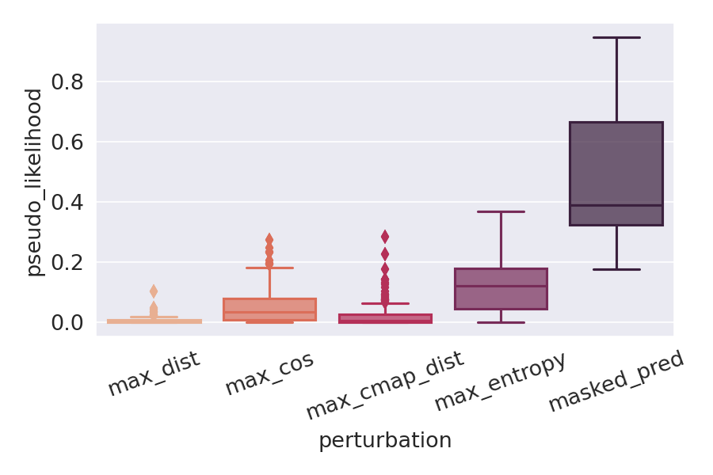
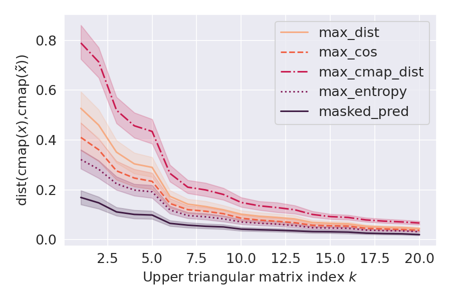
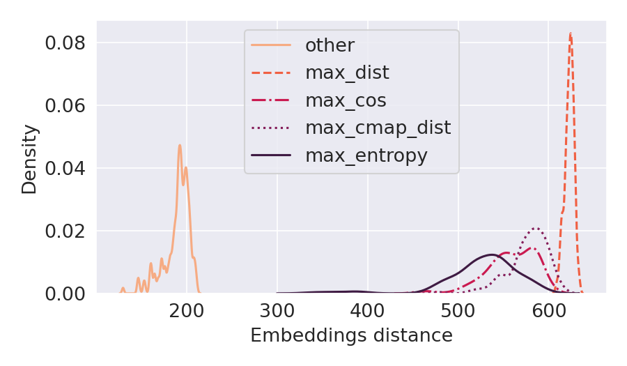
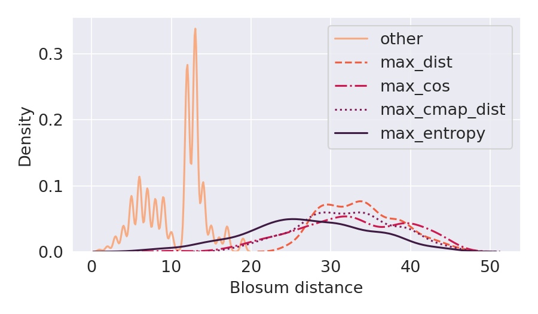
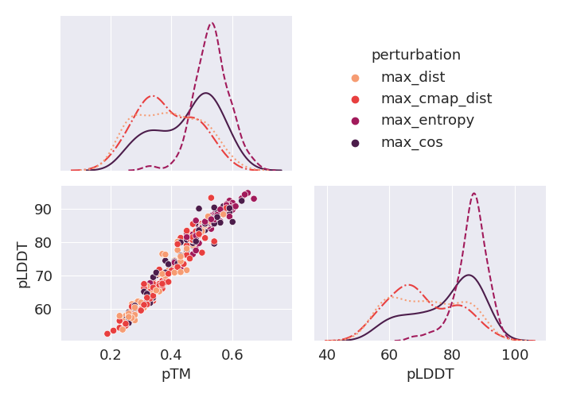
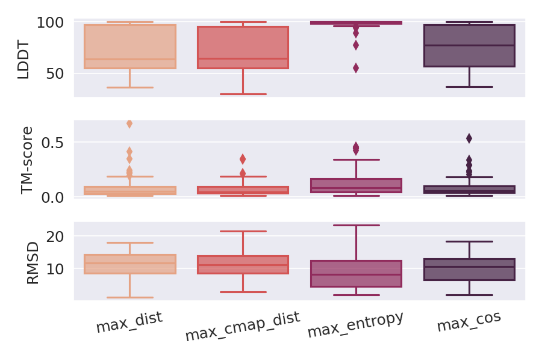

# Adversarial Attacks on Protein Language Models

Ginevra Carbone, Francesca Cuturello, Luca Bortolussi, Alberto Cazzaniga (2022).

## Abstract

Deep Learning models for protein structure prediction, such as AlphaFold2, leverage Transformer architectures and their attention mechanism to capture structural and functional properties of amino acid sequences. Despite the high accuracy of predictions, biologically insignificant perturbations of the input sequences, or even single point mutations, can lead to substantially different 3d structures. On the other hand, protein language models are often insensitive to biologically relevant mutations that induce misfolding or dysfunction (e.g. missense mutations). Precisely, predictions of the 3d coordinates do not reveal the structure-disruptive effect of these mutations. Therefore, there is an evident inconsistency between the biological importance of mutations and the resulting change in structural prediction.
Inspired by this problem, we introduce the concept of adversarial perturbation of protein sequences in continuous embedding spaces of protein language models. Our method relies on attention scores to detect the most vulnerable amino acid positions in the input sequences. Adversarial mutations are biologically diverse from their references and are able to significantly alter the resulting 3d structures.

## Experiments

### Code structure

- `requirements/` contains the list of required packages and the instructions to install virtual environments for protein LMs in `fair-esm` and structure prediction in `ColabFold`.
- `preprocess/` implements MSA preprocessing using `hhfilter()` method from HH-suite tool. Specifially, it filters the alignemnts for a chosen protein family by selecting a subset of maximally diverse sequences according to their degree of homology in the MSA.
- `src/` implements adversarial attacks computation and evaluation (`attack_*.py`) against ESM-1b and MSA Transformer models using the following attack strategies: maximum euclidean distance, maximum cosine similarity, maximum contact maps distance, maximum entropy (MSA Transfomer only). Additionally, it implements structure prediction using ColabFold (`predict_structures.py`)
- `exec/` implements PBS scripts for jobs scheduling.

### Setup

**Environments:** Follow the instructions from `requirements/readme.md`.

**Arguments:**

- `DATA_DIR` is the input data directory;
- `OUT_DIR` is the output data directory;
- `DATASET` is the dataset filename;
- `MAX_TOKENS` optionally cuts sequences to a maximum number of tokens (default is `None` and takes the whole sequence);
- `N_SEQUENCES` optionally chooses a maximum number of sequences from the dataset (`None` keeps all the available sequences);
- `MIN_FILTER` sets the minimum number of sequences used to build the reference filtered MSA for each input sequence;
- `N_SUBSTITUTIONS` is the number of desired token substitutions in the perturbed sequences;
- `TARGET_ATTENTION` is the chosen attention strategy. Default `last_layer` computes attention only on the last layer, while `all_layers` takes the average from all attention layers;
- `TOKEN_SELECTION` is the method used to select the most relevant token indexes in the sequence. Default `max_attention` maximizes the attention scores;
- `LOSS_METHOD` is the loss function used to compute gradients in the first embedding space for maximum cosine perturbations. Default `max_masked_prob` penalizes the highest pseudo-likelihood score attributed to the first embedding of the adversarial sequence.
- `DEVICE` sets the desired running device (choose `cuda` or `cpu`).

### Attack example

Attack MSA Transformer model using 3 sites mutations on 100 sequences from protein family PF00627.

```
module load conda/4.9.2
conda activate esm

cd src/
./hhfilter.sh PF00627
python attack_msa.py --data_dir=DATA_DIR --out_dir=OUT_DIR --dataset=PF00627 \
	--n_sequences=100 --min_filter=100 --n_substitutions=3 --device=cuda
```

 

 


### Structure prediction example
	
Predict 3d structures for the attacks generated in the previous example, using an 80% pLLDT threshold on predictions of the original structures.

```
conda activate ~/colabfold_batch/colabfold-conda/
module load cuda/11.0.3

python predict_structures.py --data_dir=$DATA_DIR --out_dir=$OUT_DIR --dataset=PF00627 \
	--n_sequences=100 --min_filter=100  --n_substitutions=3 --plddt_ths=80
```

 


### Full set of experiments

- `exec/attack_single_seq.pbs` attacks ESM-1b on the chosen protein family;
- `exec/attack_msa.pbs` attacks MSA Transformer on the chosen protein family;
- `exec/attack_protherm.pbs` attacks either ESM-1b or MSA Transformer on sequences from ProTherm database;
- `exec/predict_structures.pbs` performs structure prediction on original and adversarial sequences from the chosen protein family.